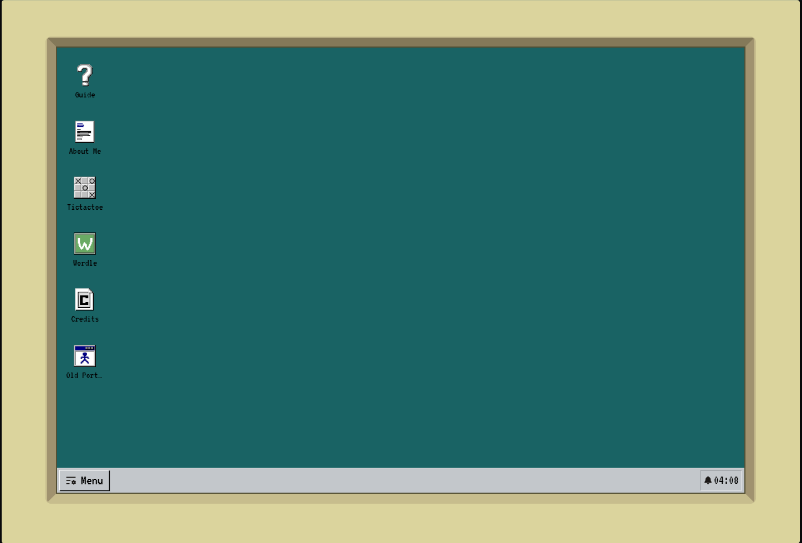
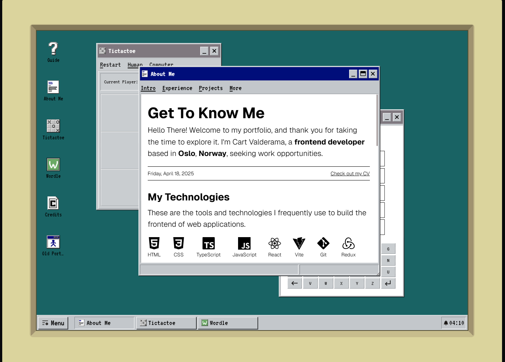
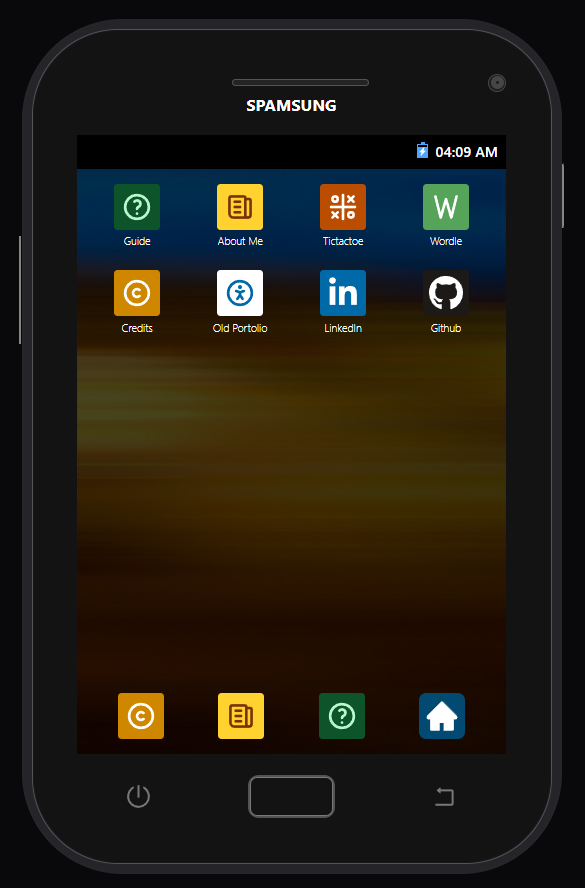
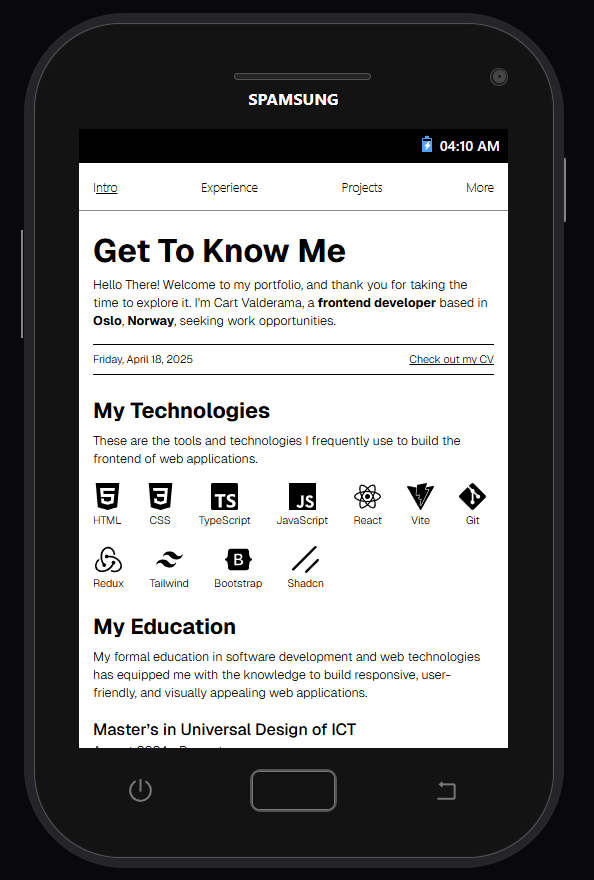

# Classic Portfolio - Retro & Modern UI

**A hybrid web experience** that adapts seamlessly from a fully interactive _Windows 95-style desktop_ on larger screens to a _Samsung Galaxy J1-inspired_ interface on mobile.

## 🌟 Key Features

### 🖥️ Desktop (Windows 95 Mode)

   
**Figure 1:** Windows 95 mode. Left: clean desktop. Right: multiple open windows.

- Authentic 90s interface with draggable, resizable windows
- Right-click menus, taskbar, and double-click interactions

### 📱 Mobile (Samsung Galaxy J1 Mode)

   
**Figure 2:** Samsung J1 mode. Left: clean home screen. Right: an open app.

- **Main Home Button** — returns to home screen
- **Shutdown Button** — replaces the traditional tab switcher

## 🛠️ Tech Stack

- ⚡ **Vite + React** – Fast build & dev experience
- 🎨 **Tailwind CSS** – Custom Win95-inspired theming
- ✨ **Framer Motion** – CRT effects and smooth window transitions
- 🧠 **Zustand** – Lightweight global state for system behavior

## 📐 Responsive Behavior

- `> 1040px`: Full desktop layout
- `< 1040px`: Mobile layout

## 🚀 Run Locally

```bash
git clone https://github.com/CartValderama/classic-portfolio
cd classic-portfolio
npm install
npm run dev
```
