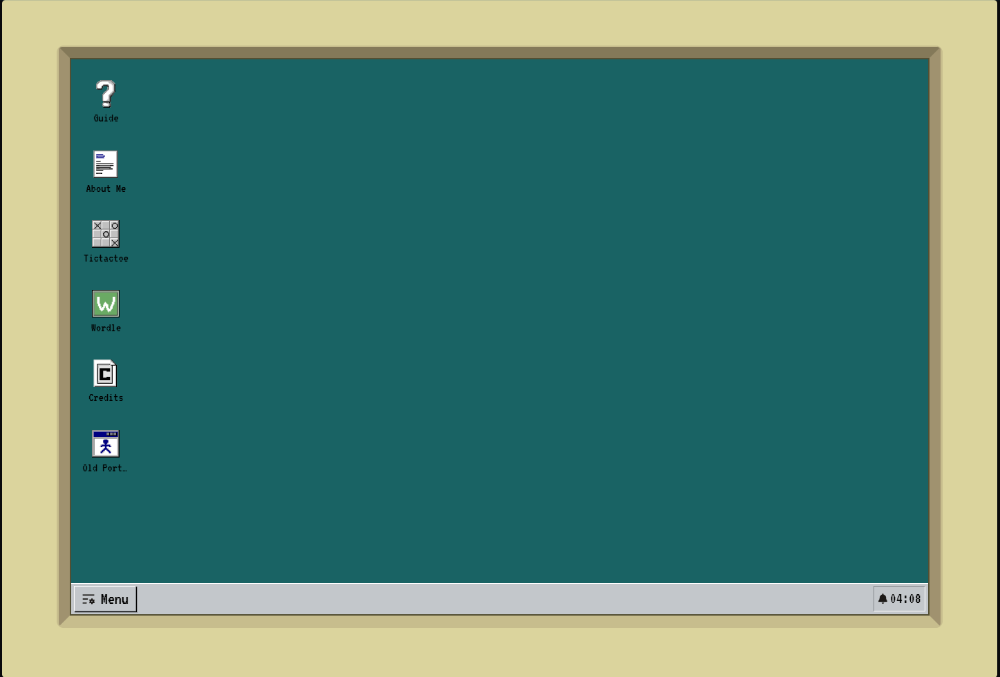
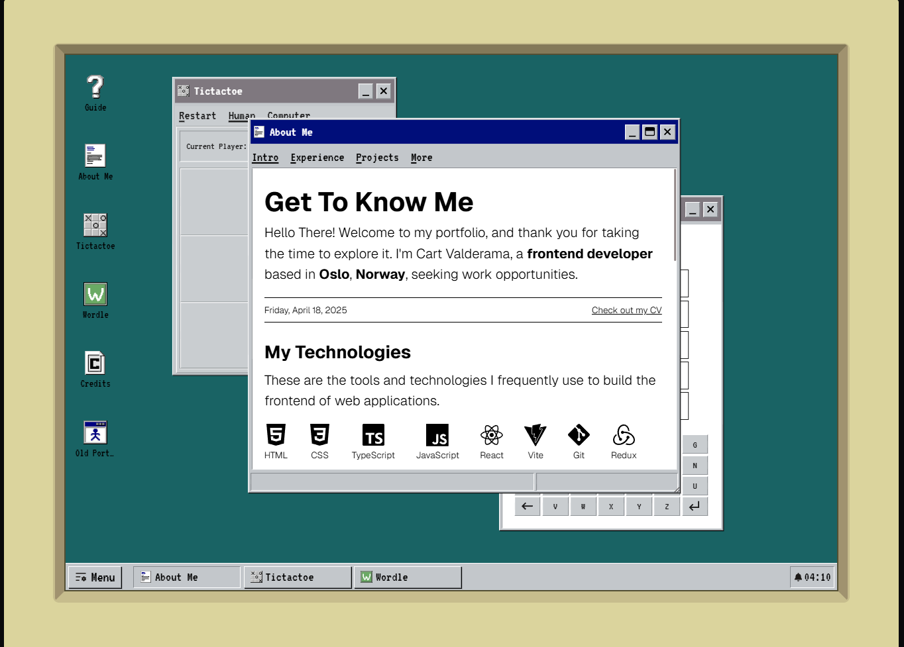
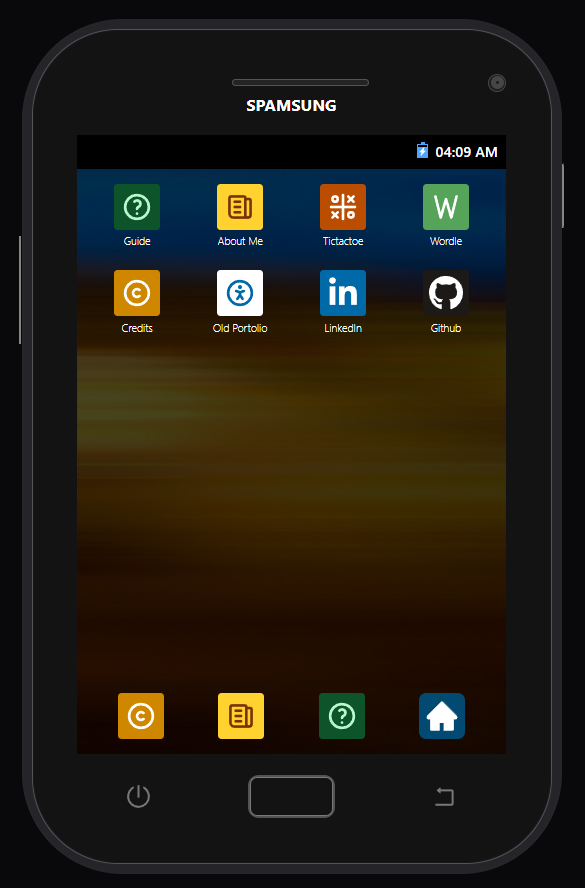
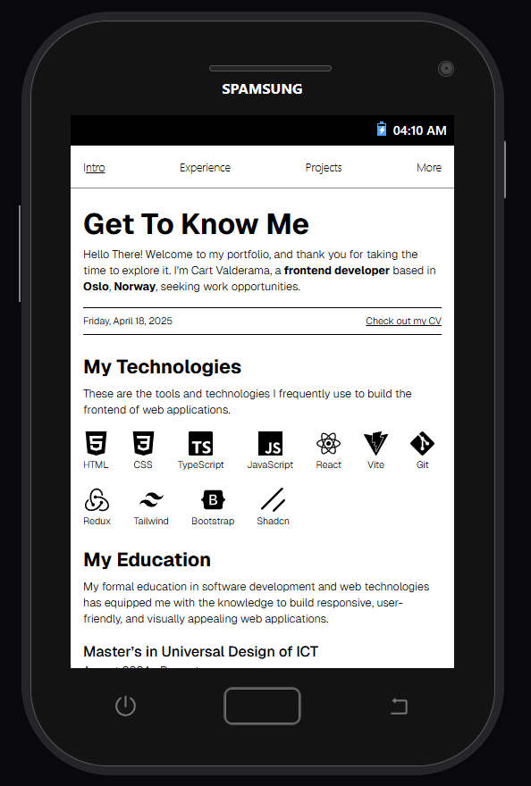

# Classic Portfolio

**A hybrid web experience** that adapts from a fully interactive _Windows 95-style desktop_ on larger screens to a _Samsung Glaxy Ace-inspired_ interface on mobile.

## Key Features

### 🖥️ Desktop (Windows 95 Mode)

- Authentic 90s interface with draggable, resizable windows
- Right-click menus, taskbar, and double-click interactions

<p>
  
  
</p>
<p>
  <em>Figure 1 & 2: Windows 95 mode — clean desktop (left) and multiple open windows (right).</em>
</p>

### 📱 Mobile (Samsung Galaxy Ace Mode)

- **Main Home Button** — returns to the home screen
- **Shutdown Button** — replaces the traditional tab switcher

<p>
  
  
</p>
<p>
  <em>Figure 3 & 4: Samsung Galaxy Ace mode — app list (left) and an open app (right).</em>
</p>

## Tech Stack

- **Vite + React**
- **Tailwind CSS**
- **Framer Motion**
- **Zustand**

## 📐 Responsive Behavior

- `> 1040px`: Full desktop layout
- `< 1040px`: Mobile layout

## Run Locally

```bash
git clone https://github.com/CartValderama/classic-portfolio
cd classic-portfolio
npm install
npm run dev
```
